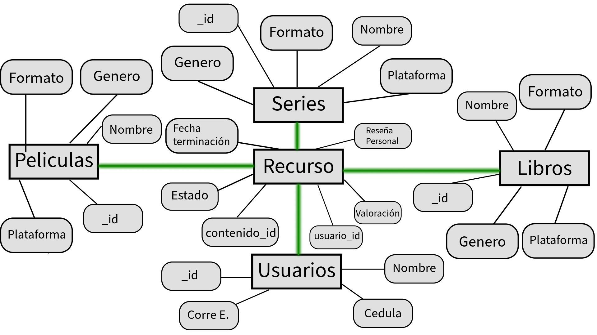

# RecursAPP 🖥️

Se requiere el diseño de una base de datos en MongoDB que sirva como soporte para una futura aplicación web orientada al seguimiento del progreso personal en series, películas y libros.

El objetivo principal de este proyecto es modelar adecuadamente las colecciones y documentos necesarios para almacenar y gestionar la información que los usuarios registrarían al usar la aplicación. Esto incluye la estructura de los datos, sus relaciones y los campos esenciales para garantizar un almacenamiento eficiente, escalable y coherente con las funcionalidades previstas.

## 🏗️ Modelo conceptual propuesto:



### 🧩 Estructura del Modelo de Base de Datos
Para este modelo se han definido cinco colecciones principales que conformarán la base de datos en MongoDB. Estas colecciones han sido diseñadas para representar de manera eficiente los distintos elementos y relaciones del sistema:

#### 📖 Libros, Películas y Series:
Estas tres colecciones representan los diferentes tipos de contenido que el usuario puede elegir. Cada una almacena información clave como:

- **_id**

- **formato**

- **nombre**

- **género**

- **plataforma** (donde se puede leer o visualizar el recurso)

#### 🧑‍🦲 Usuarios:
Esta colección almacena los datos personales de cada usuario del sistema, incluyendo:

- **_id**

- **nombre**

- **cédula** (Cedula es un campo adicional que hace parte de la información del usuario, por lo tanto no se usa como campo de relacionamiento.)

- **correo electrónico**
Cada usuario podrá asociar múltiples recursos según su progreso.

#### 📑 Recursos:
Esta colección actúa como un registro de seguimiento que vincula a los usuarios con los contenidos que están explorando (ya sean libros, películas o series). Contiene información detallada del avance y la experiencia del usuario, como:

- **estado** (en progreso, finalizado, pendiente)

- **fecha de finalización**

- **reseña personal**

- **valoración** (calificación dada por el usuario)

Este modelo está orientado a establecer una base sólida para la construcción de la base de datos, permitiendo un almacenamiento organizado, coherente y fácilmente escalable para futuras funcionalidades de la aplicación.

## 🗄️ Inserción de datos:

Ya teniendo el modelado preparado se insertan los datos que llenaran las claves en cada documento:

### ✔️ Ejemplo de inserciones en la colección de libros

```json
[
  { "_id": "l1", "nombre": "1984", "genero": "Distopía", "plataforma": "Kindle" },
  { "_id": "l2", "nombre": "Cien años de soledad", "genero": "Realismo mágico", "plataforma": "Google Books" },
  { "_id": "l3", "nombre": "El señor de los anillos", "genero": "Fantasía", "plataforma": "Audible" },
  { "_id": "l4", "nombre": "Sapiens", "genero": "Historia", "plataforma": "Amazon Books" },
  { "_id": "l5", "nombre": "Orgullo y prejuicio", "genero": "Romance", "plataforma": "Kindle" }
]
```
<hr>

### ✔️ Ejemplo de inserciones en la colección de peliculas

```json
[
  { "_id": "p1", "nombre": "Inception", "genero": "Ciencia ficción", "plataforma": "Netflix" },
  { "_id": "p2", "nombre": "El Padrino", "genero": "Crimen", "plataforma": "Paramount+" },
  { "_id": "p3", "nombre": "Interstellar", "genero": "Ciencia ficción", "plataforma": "HBO Max" },
  { "_id": "p4", "nombre": "Titanic", "genero": "Drama", "plataforma": "Star+" },
  { "_id": "p5", "nombre": "Gladiador", "genero": "Acción", "plataforma": "Amazon Prime Video" }
]
```
<hr>

### ✔️ Ejemplo de inserciones en la colección de series

```json
[
  { "_id": "s1", "nombre": "Breaking Bad", "genero": "Drama", "plataforma": "Netflix" },
  { "_id": "s2", "nombre": "Stranger Things", "genero": "Ciencia ficción", "plataforma": "Netflix" },
  { "_id": "s3", "nombre": "Game of Thrones", "genero": "Fantasía", "plataforma": "HBO Max" },
  { "_id": "s4", "nombre": "The Mandalorian", "genero": "Ciencia ficción", "plataforma": "Disney+" },
  { "_id": "s5", "nombre": "Friends", "genero": "Comedia", "plataforma": "HBO Max" }
]
```

<hr>

### ✔️ Ejemplo de inserciones en la colección de usuarios

```json
[
  { "_id": "u1", "nombre": "Laura Gómez", "cedula": "1010101010", "correo": "laura.gomez@email.com" },
  { "_id": "u2", "nombre": "Carlos Ruiz", "cedula": "2020202020", "correo": "carlos.ruiz@email.com" },
  { "_id": "u3", "nombre": "Mariana Torres", "cedula": "3030303030", "correo": "mariana.torres@email.com" },
  { "_id": "u4", "nombre": "Santiago Pérez", "cedula": "4040404040", "correo": "santiago.perez@email.com" },
  { "_id": "u5", "nombre": "Andrea Romero", "cedula": "5050505050", "correo": "andrea.romero@email.com" }
]
```

<hr>

### ✔️ Ejemplo de inserciones en la colección de Recurso

```json
[
  {
    "usuario_id": "u1",
    "formato": "libro",
    "contenido_id": "l3",
    "estado": "Finalizado",
    "fecha_terminacion": "2025-07-10",
    "resena_personal": "Una obra épica",
    "valoracion": 10
  },
  {
    "usuario_id": "u2",
    "formato": "pelicula",
    "contenido_id": "p5",
    "estado": "En progreso",
    "fecha_terminacion": null,
    "resena_personal": "Combate impresionante",
    "valoracion": 8
  },
  {
    "usuario_id": "u2",
    "formato": "serie",
    "contenido_id": "s8",
    "estado": "Pendiente",
    "fecha_terminacion": null,
    "resena_personal": "",
    "valoracion": null
  },
  {
    "usuario_id": "u4",
    "formato": "pelicula",
    "contenido_id": "p13",
    "estado": "Finalizado",
    "fecha_terminacion": "2025-08-01",
    "resena_personal": "Mindblowing",
    "valoracion": 10
  },
  {
    "usuario_id": "u2",
    "formato": "serie",
    "contenido_id": "s2",
    "estado": "En progreso",
    "fecha_terminacion": null,
    "resena_personal": "Me encanta la trama",
    "valoracion": 9
  }
]
```

## Consultas básicas

Algunas consultas básicas para probar los datos introducidos anteriormente:

### 📌 1. Recursos finalizados por el usuario con ID "u2"
Esta consulta devuelve todos los contenidos que el usuario identificado como "u2" ha finalizado, sin importar su formato (libro, serie o película).

```jsx
db.recursos.find({
  formato: "pelicula",
  valoracion: { $gte: 9 }
})

```

### 📌 2. Películas con calificación igual o superior a 9
Esta consulta muestra todos los recursos cuyo formato es "pelicula" y que han recibido una valoración destacada (9 o 10).

```jsx
db.recursos.find({
  formato: "pelicula",
  valoracion: { $gte: 9 }
})

// El operador $gte en MongoDB significa "greater than or equal", es decir, "mayor o igual que".
//Se utiliza para hacer comparaciones numéricas, de fechas, o incluso de cadenas alfabéticas, dependiendo del contexto.
```

## ✅ Conclusión 

El modelado de esta base de datos en MongoDB permite estructurar de manera eficiente la información relacionada con el seguimiento de recursos de entretenimiento —libros, películas y series— por parte de los usuarios. Mediante el uso de colecciones bien definidas y relaciones claras entre documentos, se facilita el registro del progreso, valoraciones y reseñas de cada contenido consumido.

Además, las consultas implementadas demuestran la versatilidad de MongoDB para filtrar, agrupar y analizar datos relevantes, lo cual respalda la funcionalidad esencial de la aplicación. Esta base de datos está preparada para escalar, integrarse con una interfaz web y brindar una experiencia personalizada a cada usuario según sus preferencias y hábitos de consumo.