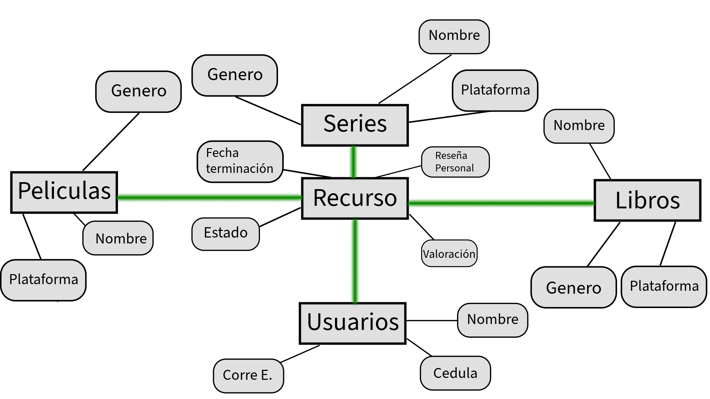

# RecursAPP 🖥️

Se requiere el diseño de una base de datos en MongoDB que sirva como soporte para una futura aplicación web orientada al seguimiento del progreso personal en series, películas y libros.

El objetivo principal de este proyecto es modelar adecuadamente las colecciones y documentos necesarios para almacenar y gestionar la información que los usuarios registrarían al usar la aplicación. Esto incluye la estructura de los datos, sus relaciones y los campos esenciales para garantizar un almacenamiento eficiente, escalable y coherente con las funcionalidades previstas.

## Modelo conceptual propuesto:

### 🧩 Estructura del Modelo de Base de Datos
Para este modelo se han definido cinco colecciones principales que conformarán la base de datos en MongoDB. Estas colecciones han sido diseñadas para representar de manera eficiente los distintos elementos y relaciones del sistema:

#### 📖 Libros, Películas y Series:
Estas tres colecciones representan los diferentes tipos de contenido que el usuario puede elegir. Cada una almacena información clave como:

- **_id**

- **formato**

- **nombre**

- **género**

- **plataforma** (donde se puede leer o visualizar el recurso)

#### 🧑‍🦲 Usuarios:
Esta colección almacena los datos personales de cada usuario del sistema, incluyendo:

- **_id**

- **nombre**

- **cédula** (Cedula es un campo adicional que hace parte de la información del usuario, por lo tanto no se usa como campo de relacionamiento.)

- **correo electrónico**
Cada usuario podrá asociar múltiples recursos según su progreso.

#### 📑 Recursos:
Esta colección actúa como un registro de seguimiento que vincula a los usuarios con los contenidos que están explorando (ya sean libros, películas o series). Contiene información detallada del avance y la experiencia del usuario, como:

- **estado** (en progreso, finalizado, pendiente)

- **fecha de finalización**

- **reseña personal**

- **valoración** (calificación dada por el usuario)

Este modelo está orientado a establecer una base sólida para la construcción de la base de datos, permitiendo un almacenamiento organizado, coherente y fácilmente escalable para futuras funcionalidades de la aplicación.

## Inserción de datos:

Ya teniendo el modelado preparado se insertan los datos que llenaran las claves en cada documento:

### Ejemplo de inserciones en la coleccion de libros